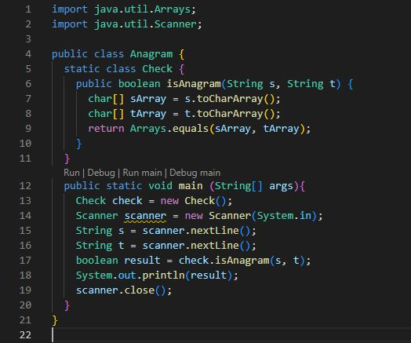
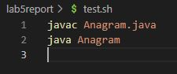
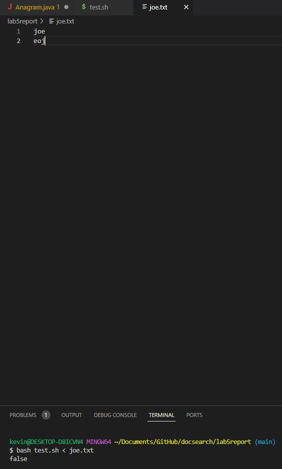
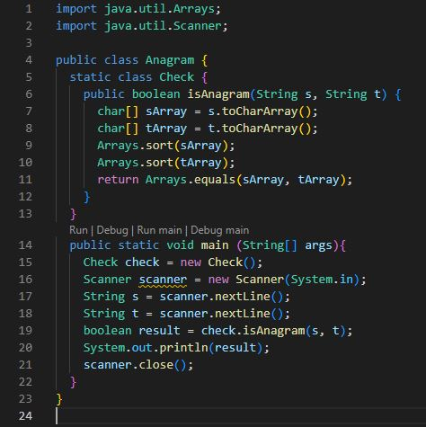
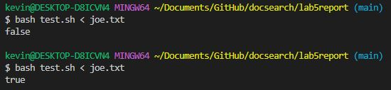
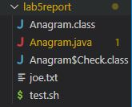

# Lab Report 5  
**Part 1**  

For starters I decided to create a new scenario in which I created a new repository in which I had a java file that was made to check if two strings were anagrams of one another (student-made) and a bash file to correctly compile and run the code, using input
that was found in a seperate text file (can be changed to test whatever words you want to test).

EdStem post: Hi, when I was working on our anagram assignment code I though I properly addressed how to check if two words were anagrams, however when I ran my code and tested it despite them being anagrams of one another
my code returned that they weren't anagrams. I am not too sure what could have been incorrect? Here are all my files and the resulting incorrect output that resulted.  

 
 
 

TA response: Take a look at the documentaion for java.util.Arrays and make sure you are using the right one's to check  whether two strings are anagrams. You currently have one that can be used, however you may be missing some! 

student reponse: After looking into the documentation I saw that when using the .equals it doesn't check for whether the contents have the same stuff it checks for an exact order! From this I knew to sort both Arrays (Arrays.sort() the s and t array), because anagrams
have the same number of letters for each word. So if checking if these contents now match we can determine whether the words are anagrams. Thank you so much!  
 
 

Here is all the information:  

 
 
 
 
As stated in the student response found that they needed to sort both arrays before using equals because it checks for exact copies of one another. 

**Part 2**  
Going through this class has honestly been one of the coolest computer science related classes I have taken as it allowed me to learn the usage of terminal as a whole. One of the coolest parts for me was working with bash code and trying to create an auto-grader
that can effertively go through a bunch of submissions and return the scores and errors of all the students did. Doing something like that I never considered I would be able to do so early into learning computer science but it was very fascinating 
to learn. One really useful part for me that I think was cool was learning how to effectively go through a ton of files and look through them with different commands from the terminal. While vim was mentioned to not be useful I found it fascinating the fact that you
could even freely open the files in your terminal and edit them. Overall this class was very fascinating and I felt like I learned so much new information that will be used in my future!  
